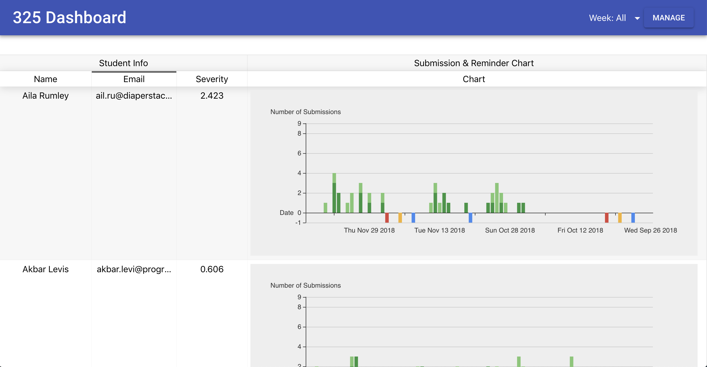

# 325poke

325poke is a web-based dashboard optimized for desktop that allows an instructor to visualize each student’s progress and thus helps the instructor to identify students who are struggling in the class.

* Graphs showing both submissions and reminders over the course of the quarter for each student, sortable by name, severity, and email

* Drop-down menu at the top that allows the instructor to view the students’ progress up to a specific week

* Admin dashboard where the instructor can enter the start and end dates of the quarter

## Team Members:

- Keren Park [@parkhk10](https://github.com/parkhk10) 
- Yul Hee Kim [yulheekim](https://github.com/yulheekim)
- Xin Tong [@XinTongBUPT](https://github.com/XinTongBUPT)
- Jayden Soni [@jaydenrsoni](https://github.com/jaydenrsoni)
- Will Klundgren [@willklundgren](https://github.com/willklundgren)
- Charles Dai [@RabbitQAQ](https://github.com/RabbitQAQ)

## Platform Compatibility
1. Node Package Manager (npm)
2. Tested on Chrome / Safari with Mac OS X

## To run
1. Clone the repository
2. From the root directory, go to ./my-app by `cd my-app`
3. Run `npm install` and `npm start`
4. This should launch the application in a browser. If not, go to http://localhost:3000

## To deploy
1. Make sure to set up a Firebase account and follow the steps here to go public before starting the project: http://www.cs.northwestern.edu/academics/courses/394/learn-react.php#go-public
2. Navigate to ./my-app/src/firebase.js and input your new Firebase project credentials in the Firebase configurations at the top of the file.
3. To deploy with sample data from Fall 2018, run updateSubmissionInDatabase(true) in ./my-app/src/firebase.js on L174. To deploy with a clean database for the start of a new quarter, navigate to ./my-app/functions/index.js and implement fetchData() to fetch submission data from server in the format presented within example-submission-data.json (more information in next section).
4. Run `npm run build` and then `firebase deploy`

From this point on, you should run `npm run build` and `firebase deploy` after step 4 in the "To Run" section.

## To set up email functionality
1. Navigate to ./my-app/functions/index.js
2. Implement fetchData() to fetch submission data from server in the format presented within example-submission-data.json.
3. Post emails object generated by getEmailsToSend() to the server to send out. A starting point for how to do this using axios is presented at the bottom of the file (this would require some reworking with the fetchData() function.
4. Based on findings from the quarter or for testing purposes, edit the email templates in the getEmailsToSend() function. The email templates used for our final demo are here: https://docs.google.com/document/d/1xvx36YSxWNsb_sDlAAnqdneH4HcwoDHsa2R6Ch8Jo5s/edit

*To see an example of what the email json to post looks like, open a browser console while running locally. The code used to generate this is present at the bottom of MainPage’s componentDidMount() function, along with a copy of the code in ./my-app/functions/index.js*

## To edit the severity calculation algorithm
1. Go to ./my-app/src/components/SubmitReminderTable/SubmitReminderTable.js

2. Go to the function `calculateSeverity()`, which is called for each student in the function `getData()`

## Files
All the pages are placed in ./my-app/src/pages, while all the smaller components are located in ./my-app/src/components. 
### MainPage (./my-app/src/pages/MainPage/MainPage.js)
- This is the homepage of the application with all the visualizations.
- Uses SubmitReminderTable component (at ./my-app/src/components/SubmitReminderTable/SubmitReminderTable.js)
- Has buttons linked to Details page (at ./my-app/src/pages/Details/Details.js) 
### ManagePage (./my-app/src/pages/ManagePage/ManagePage.js)
- This is the admin page of the application with control over time of the quarter, email format, and students. 

### Firebase Functions (./my-app/functions/index.js)
- Has all the functions to fetch data from the server and update Firebase's Realtime Database accordingly. 
- Schedules the database update and the email request through the function, `updateDatabaseAndSendEmailFinal`
- These functions of these functions are available in ./my-app/src/firebase.js
